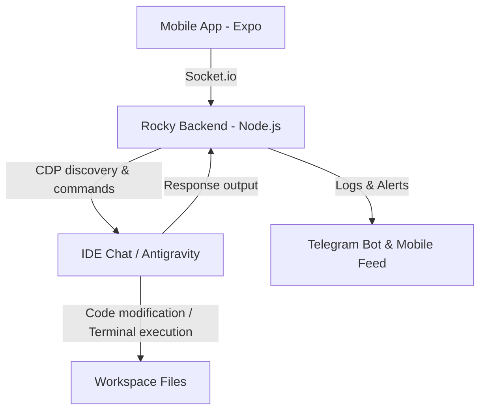

# Rocky: Phone-to-IDE Developer Bridge 🚀


[](https://github.com/RockyVicky/rocky-ide-bridge)

Rocky is an open-source development bridge that connects your mobile device directly to your IDE (e.g., VS Code or Antigravity IDE) via WebSockets and the Chrome DevTools Protocol (CDP). 

With Rocky, you can speak or type commands on your phone (using Gemini 2.5 Flash for high-fidelity speech-to-text transcription), trigger workspace macros, inject prompts directly into your AI agent's chat window, and receive real-time execution logs/notifications on your phone and Telegram.

> [!IMPORTANT]
> **Core USP (Unique Selling Proposition)**: Real-time, zero-click mobile-to-IDE communication. Instead of running complex and heavy AI environments on your mobile device, Rocky operates as a low-latency bridge, allowing your phone to interact with the high-performance AI agent and file systems running locally on your workstation.

---

## Architecture Flow



1. **Trigger**: You speak or type a macro (e.g., *"Create a new home page component"*) into the Rocky Mobile App.
2. **Transcription**: The audio file is securely sent to the Rocky Backend, which transcribes it instantly using the Gemini 2.5 Flash API.
3. **Injections**: The Backend discovers the local IDE's active debug port (usually ports 9000-9015) and uses the Chrome DevTools Protocol (CDP) to inject the message directly into the IDE agent's chat box and click send.
4. **Execution**: The IDE agent (like Antigravity) completes the task (writing files, running tests).
5. **Logs & Telegram**: A filesystem watch-dog (`tmp_antigravity_reply.txt`) captures updates from the agent, and forwards execution logs back to the phone's feed and your Telegram bot in real-time.

---

## Features

- 🎙️ **Voice Commands**: Fast voice-to-code translations powered by Gemini 2.5 Flash.
- 🔌 **CDP Bridge**: Remote-controls the IDE’s chat/prompt interface without any extensions required.
- ⚡ **Zero-Click Reverse Handoff**: A lightweight file watch-dog relays the local agent's thoughts back to the developer's mobile device.
- 📲 **Multi-Channel Feeds**: Outputs go to both the Expo Mobile App and Telegram.
- 🧠 **Hybrid Strategic Planning (Optional)**: Connects to LangGraph / CrewAI for multi-agent coordination when solving complex, multi-step tasks.

---

## Repository Structure

- [backend/](file:///e:/Autonomous/files/jarvis/backend) - Node.js service exposing the HTTP API, Socket.io connection, CDP bridge, and agent planners.
- [mobile-app/](file:///e:/Autonomous/files/jarvis/mobile-app) - React Native Expo application for controlling Rocky from iOS and Android.
- [docs/](file:///e:/Autonomous/files/jarvis/docs) - Documentation assets, checklists, and guides.

---

## Setup Instructions

### 1. Prerequisites
- **Node.js** (v18 or higher)
- **NPM** (v9 or higher)
- **Expo Go** app installed on your physical mobile device (iOS or Android)
- **Antigravity IDE** or any VS Code-based workbench running with debugging enabled

### 2. Running the IDE with Debug Port
Rocky relies on Chrome DevTools Protocol (CDP) to communicate with your IDE window. You must launch your IDE with debugging active:
```bash
# Example for Antigravity IDE (default debug port 9015)
antigravity-ide.cmd --remote-debugging-port=9015 .
```

### 3. Backend Setup
Navigate to the `backend/` directory:
```bash
cd backend
npm install
```
Configure your environment variables:
```bash
copy .env.example .env
```
Open `.env` and configure:
* `GEMINI_API_KEY`: Required for speech-to-text.
* `TELEGRAM_BOT_TOKEN` & `TELEGRAM_USER_ID`: To receive mobile execution updates.
* `NGROK_AUTHTOKEN` (Optional): To run a persistent public tunnel.

Run the development server and tunnel:
```bash
# Start backend server (binds to port 3001)
npm run dev

# Start localtunnel/ngrok to expose the server to your mobile app
npm run tunnel
```

### 4. Mobile App Setup
Navigate to the `mobile-app/` directory:
```bash
cd ../mobile-app
npm install
npx expo start
```
1. Scan the QR code using your phone's camera (iOS) or the Expo Go app (Android).
2. Grab the public tunnel URL printed in the `npm run tunnel` console window.
3. Open the Setup screen inside the Rocky Mobile App and enter this tunnel URL to link the phone to your IDE backend.

---

## Regional Setup: Bypassing ISP Telegram Blocks (India & others)

In some regions, ISPs throttle or block the default Telegram Bot API endpoint (`api.telegram.org`), resulting in connection timeouts or failure to receive logs. 

To solve this, Rocky supports routing requests through a custom Telegram API Root. You can deploy a free, lightweight Cloudflare Worker to act as a reverse proxy:

### 1. Create a Cloudflare Worker
1. Log in to your [Cloudflare Dashboard](https://dash.cloudflare.com/).
2. Navigate to **Workers & Pages** -> **Create Application** -> **Create Worker**.
3. Name it (e.g., `telegram-proxy`) and click **Deploy**.

### 2. Configure the Worker Code
Click **Edit Code** in the Cloudflare console and replace the entire script with:

```js
addEventListener('fetch', event => {
  event.respondWith(handleRequest(event.request))
})

async function handleRequest(request) {
  const url = new URL(request.url)
  // Proxy all incoming traffic to the official Telegram Bot API
  url.hostname = 'api.telegram.org'
  
  return fetch(url.toString(), {
    method: request.method,
    headers: request.headers,
    body: request.body
  })
}
```
Deploy the script changes.

### 3. Set the Variable in `.env`
Copy your deployed worker URL (e.g., `https://telegram-proxy.yourname.workers.dev`) and add it to your `backend/.env` file:
```env
TELEGRAM_API_ROOT=https://telegram-proxy.yourname.workers.dev
```
Restart your Rocky backend. The bot will now communicate securely through your custom Cloudflare tunnel.

---

## Troubleshooting

For deep dives into issues like **"Failed to inject into IDE. Reason: busy"**, port scanning conflicts, or websocket disconnects, please see our dedicated [TROUBLESHOOTING.md](file:///e:/Autonomous/files/jarvis/backend/TROUBLESHOOTING.md) guide.

---

## Star History

[](https://star-history.com/#RockyVicky/rocky-ide-bridge)

---

## License

This project is open-source and available under the [MIT License](LICENSE).
